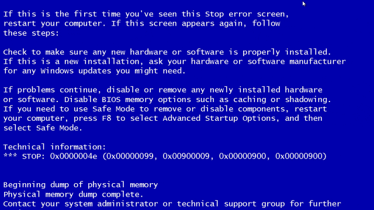

 

  

  <h3>About me:</h3>
  <ul>
    <li>I use Windows, please don't hate me!</li>
    <li>I also use linux to look cool.</li>
    <li>Currently taking a dive in web development.</li>
    <li>Pursuing  B.E. in Computer Engineering.</li>
  </ul>

  

  <h3 align="left">Languages and frameworks</h3>
   <a href="https://www.w3schools.com/cpp/" target="_blank">  
  <h3 align="left">Tools:</h3>
  
 

  <h3 align="left">Connect with me:</h3>
  

  
  
  
  

